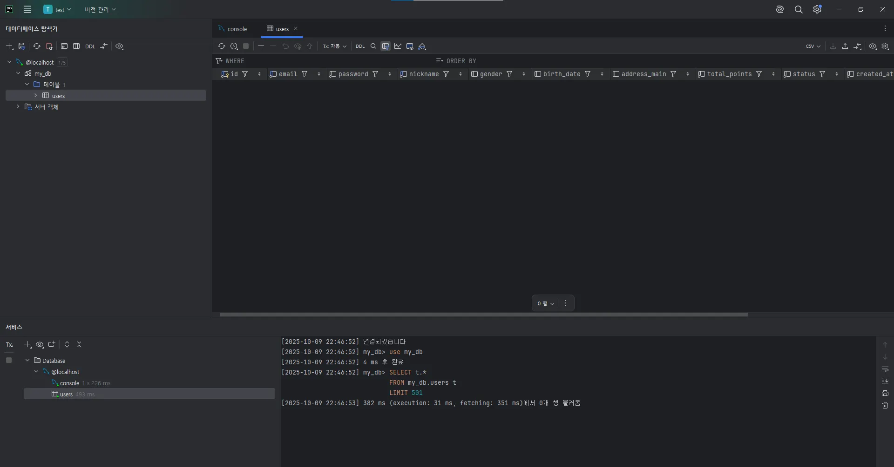

1. 로컬 DB 만들어서 users 테이블 생성

CREATE DATABASE my_db;
USE my_db;

CREATE TABLE users (
    id BIGINT PRIMARY KEY AUTO_INCREMENT,  -- 사용자 고유 ID (자동 증가)
    email VARCHAR(255) NOT NULL UNIQUE,     -- 이메일 (필수, 중복 불가)
    password VARCHAR(255) NOT NULL,         -- 비밀번호 (필수)
    nickname VARCHAR(50) NOT NULL UNIQUE,   -- 닉네임 (필수, 중복 불가)
    gender VARCHAR(10),                     -- 성별
    birth_date DATE,                        -- 생년월일
    address_main VARCHAR(255),              -- 주소
    total_points INT NOT NULL DEFAULT 0,    -- 보유 포인트 (기본값 0)
    status VARCHAR(15) NOT NULL DEFAULT 'ACTIVE', -- 계정 상태 (기본값 'ACTIVE')
    created_at DATETIME(6) NOT NULL DEFAULT CURRENT_TIMESTAMP(6), -- 생성 시각
    updated_at DATETIME(6) NOT NULL DEFAULT CURRENT_TIMESTAMP(6) ON UPDATE CURRENT_TIMESTAMP(6), -- 수정 시각
    deleted_at DATETIME(6)                  -- 삭제 시각 (Soft Delete용)
);

2. 파일구조 만들어서 깃허브에 푸시
https://github.com/Park-seoyun/umc-workbook